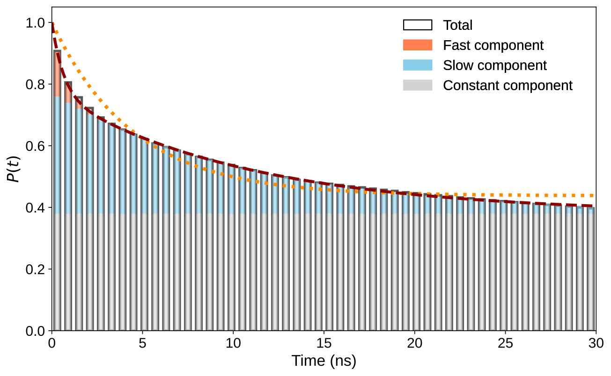
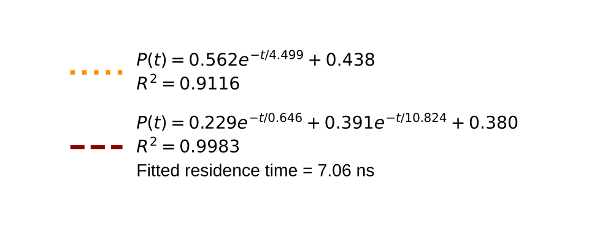
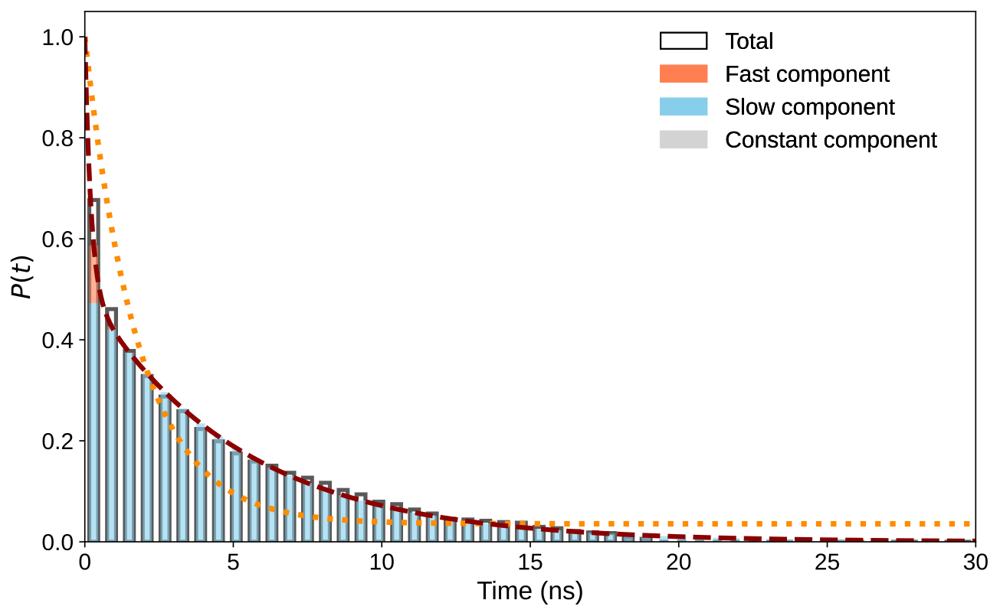
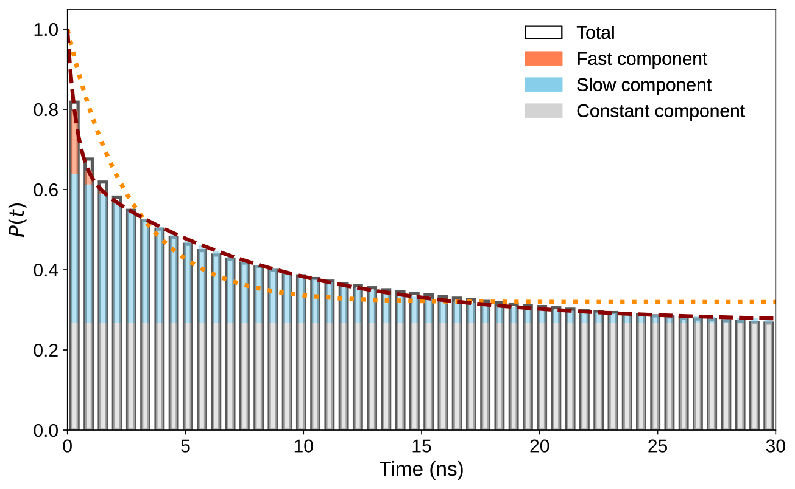

# md-residence-kinetics

Survival probability (SP) analysis for water and solute residence kinetics from MD trajectories. Computes SP decay curves, fits single/bi-exponential models, and provides model-free metrics (RMST).

## Example Output

| SP decay + bi-exponential fit | Fit parameters |
|:---:|:---:|
|  |  |

More examples in [`examples/`](examples/).

## Installation

```bash
git clone https://github.com/AlanineX/md-residence-kinetics.git
cd md-residence-kinetics
pip install -r requirements.txt
```

## Quick Start

```bash
# 1. Edit TOP_PATH, TRAJ_PATH, and OUT_DIR
nano scripts_kinetics/config_extract.py

# 2. Run extraction + fitting
cd scripts_kinetics
python run_extract.py

# 3. (Optional) Re-fit/re-plot existing SP CSVs with different settings
python run_plot.py

# 4. (Optional) Plot existing additive-attribution CSVs independently
python run_plot_attribution.py
```

## What It Does

1. **Counts** average probe (water/solute) occupancy per region
2. **Computes** survival probability $S(\tau)$ via block-parallel time correlation
3. **Fits** single-exp $(1-c)\exp\left(-\frac{t}{\tau}\right)+c$ and bi-exp models
4. **Calculates** model-free metrics: $\operatorname{RMST}(t^*)$ and $S(t^*)$ at fixed horizons
5. **Outputs** per-region CSVs, summary text files, SVG plots, and aggregate fitting CSVs
6. **Optionally decomposes** a regional SP curve into additive component contributions without double-counting overlapping shells

## Config Reference (`config_extract.py`)

### Trajectory

| Key | Meaning |
|-----|---------|
| `TOP_PATH` | Topology file (PDB/GRO/TPR) |
| `TRAJ_PATH` | Trajectory file (XTC/TRR) |
| `OUT_DIR` | Output directory |
| `START_FRAME` / `STOP_FRAME` | Frame range (`None` = full trajectory) |

### Analysis

| Key | Default | Meaning |
|-----|---------|---------|
| `FIRST_SHELL_A` | 3.5 | Distance cutoff (angstrom) for probe selection |
| `WATER_O_SELECTION` | `"name OW OH2"` | MDAnalysis selection for water oxygens |
| `INTERMITTENCY` | 0 | Allow probe to leave for N frames and still count as survived |
| `COUNT_STATS_MAX_FRAMES` | 500 | Max frames for occupancy estimate (0 = skip) |
| `N_PROCS` | 10 | Worker processes for multiprocessing |
| `N_BLOCKS` | 1 | Trajectory blocks for block averaging |
| `DO_EXP_FIT` | True | Fit exponential decay models |

### SP Timing Settings

Used in `PROTEIN_SHELL_SETTINGS`, `PER_RESIDUE_SETTINGS`, and per-target configs:

| Key | Example | Meaning |
|-----|---------|---------|
| `time_resolution_ns` | 0.01 | Time step for SP calculation. Frames are strided to match. |
| `tau_max_ns` | 5.0 | Maximum lag time. **Must be < `trajectory_length / 2`.** |
| `t0_spacing_ns` | 0.5 | Spacing between time origins. Smaller = better statistics, slower. Aim for >= 20 origins. |
| `n_blocks` | 1 | Blocks for this target (overrides global `N_BLOCKS`). |

### Protein Shell & Per-Residue

| Key | Values | Meaning |
|-----|--------|---------|
| `CALC_PROTEIN_SHELL` | `True`/`False` | SP for all water near protein |
| `CALC_PER_RESIDUE_SHELL` | `False` = skip, `True` = all, `"0:49"` = range | Per-residue SP; each chain and residue is analyzed separately |

### Target Configs

`TARGET_CONFIGS` is a list of dicts defining custom regions:

```python
TARGET_CONFIGS = [
    {"name": "ligand_shell",
     "probe_type": "solute",          # "water" or "solute"
     "resnames": ["LIG"],             # replace LIG with its topology resname
     "resid_ranges": ["52 53 87"],    # protein residues (one string per chain)
     "chains": "ABCD",               # optional chain filter
     "time_resolution_ns": 0.01,
     "tau_max_ns": 5.0,
     "t0_spacing_ns": 0.5,
     "n_blocks": 5,
     "description": "Ligand near my binding site"},
]
```

`resnames` uses the residue name stored in the topology. For example, a ligand
named `ATP` in the topology should use `"resnames": ["ATP"]`.

### Additive Component Attribution

Add a `components` mapping to any custom target when you need to identify which
residues or subregions dominate the regional kinetics:

```python
TARGET_CONFIGS = [{
    "name": "pocket",
    "core": "protein and resid 10:20",
    "components": {
        "entrance": "protein and resid 10:14",
        "core": "protein and resid 15:20",
    },
    "attribution_horizons_ns": [1.0, 2.0, 5.0],
    "time_resolution_ns": 0.01,
    "tau_max_ns": 5.0,
    "t0_spacing_ns": 0.5,
}]
```

For each time origin, a probe in $k$ overlapping component shells contributes
$\frac{1}{k}$ to each shell. Its component label is fixed at that origin, while survival
is followed in the union of all component shells. Therefore,

$$
S_{\mathrm{region}}(t) = \sum_j S_j^{\mathrm{contribution}}(t).
$$

This is initial-membership attribution: it answers which starting component
contributed the surviving population. It does not mean that a probe remained in
that same component for the full lag time. The extraction command writes the
component data as CSV; it does not create an attribution plot.

For a per-residue water example, see
[`examples/config_extract_barnase_water.py`](examples/config_extract_barnase_water.py).

## Output

| File | Content |
|------|---------|
| `sp_<name>.csv` | tau (ns) vs SP curve |
| `summary_<name>.txt` | Fit parameters, residence times, counts |
| `plots/<name>.svg` | SP decay plot with fitted curves |
| `single_exp_fitting_results.csv` | All regions: 1-exp fit + counts + RMST |
| `bi_exp_fitting_results.csv` | All regions: 2-exp fit + counts + RMST |
| `run_settings.log` | Full run configuration |
| `attribution_<name>.csv` | Regional SP and additive component curves |
| `attribution_integrals_<name>.csv` | Component integrals and origin-population shares |

### Standalone Attribution Plots

Edit `config_plot_attribution.py`, then run `python run_plot_attribution.py`.
This step reads existing `attribution_*.csv` files and does not load the
trajectory, rerun extraction, or rerun decay fitting. The default plot uses
increasing residue/component identifiers, identity-based harmonic colors, and
no title. The configuration can instead rank by initial population percentage,
integrated contribution, input order, alphabetical order, or an explicit manual
order. Colors can follow component identity or stack position, with optional
per-component overrides. The harmonic palette is interpolated to the exact
number of components, so it supports fewer or more than seven residues.

### Aggregate CSV Columns

| Column | Meaning |
|--------|---------|
| `avg_count` / `std_count` | Mean probe occupancy in region |
| `tau`, `tau1`, `tau2` | Exponential decay time constants (ns) |
| `c` | Constant offset (non-exchanging fraction) |
| `apparent_res_time` | Integral of $S(t)-c$ from 0 to $\tau_{\max}$ |
| `fitted_res_time` | $\alpha_1\tau_1 + \alpha_2\tau_2$ (analytical integral to infinity) |
| `t_half_overall` | Time when $S(t)$ drops to midpoint between 1 and $c$ |
| `RMST_1ns`, `RMST_2ns`, `RMST_5ns` | Restricted mean survival time at 1/2/5 ns horizons (model-free) |
| `S_1ns`, `S_2ns`, `S_5ns` | Raw SP value at 1/2/5 ns (model-free) |

## More Examples

**Different binding sites show distinct kinetics:**

| Site 0 (fast exchange) | Site 47 (slow exchange) |
|:---:|:---:|
|  |  |

## Known Issues

- MDAnalysis <= 2.9.0 has a memory corruption bug when re-loading large XTC files (>500K atoms). Workaround: the pipeline loads the Universe once and reuses it. For subprocess-based runs, each site gets a fresh process.
