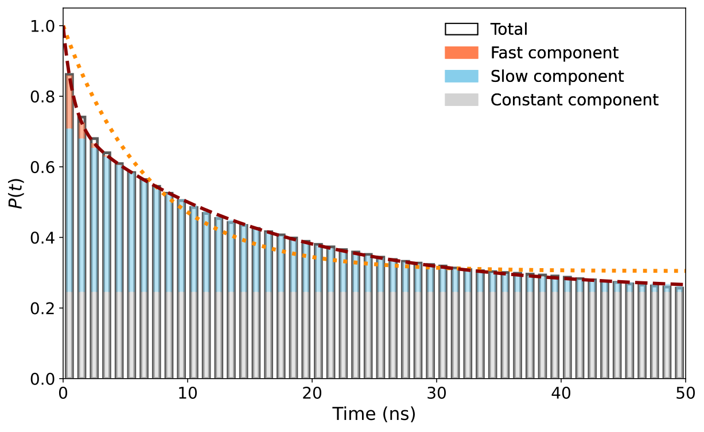
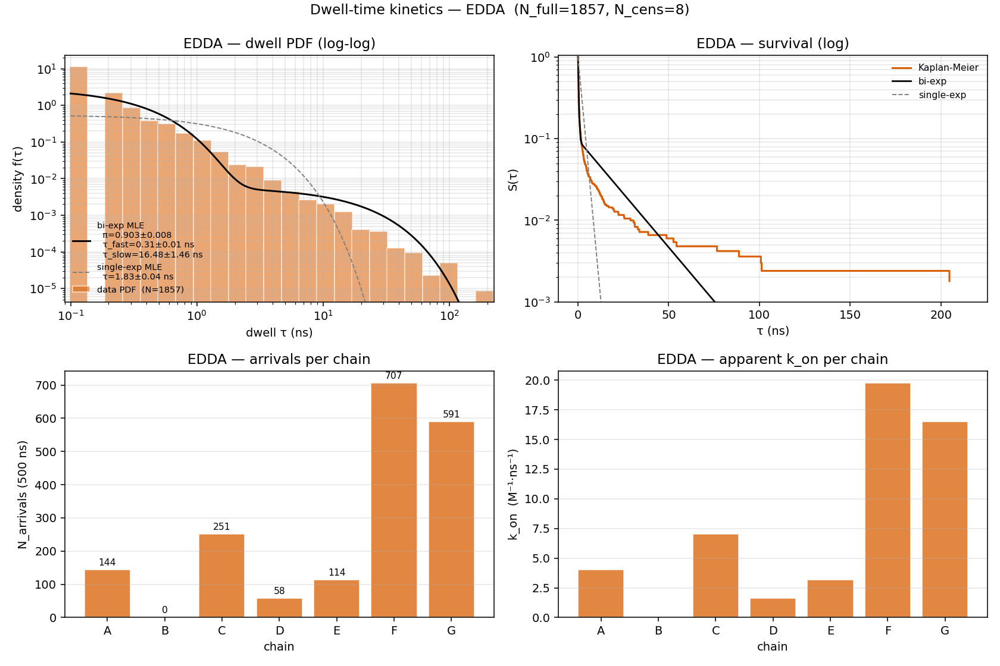
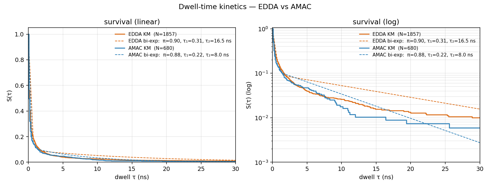

# Two ways to compute residence time — a methods note

We have two analyses that both report a "residence time" but **measure
different things**. They are complementary, not redundant. This note
walks through each method **stepwise on real data** (EDDA chain F,
500 ns, 707 binding events) so the difference is concrete.

---

## TL;DR

| | **Population** $\mathrm{SP}(\tau)$ **fit** | **Dwell-time MLE** |
|---|---|---|
| Input | binary contact matrix → $\mathrm{SP}(\tau)$ curve | binary contact matrix → list of event durations |
| What's a "data point" | a value of $\mathrm{SP}$ at lag $\tau$ | one binding event |
| Weighting | **time-weighted** (samples $t_0$ uniformly in time) | **event-weighted** (each event counted once) |
| Output | apparent $\tau_{\mathrm{off}}$ (and bi-exp components) | $k_{\mathrm{off}}$, $k_{\mathrm{on}}$, $K_d$ per component |
| Bias | toward **long** events (they occupy more time) | none, but flickers dominate by count |

Both views are correct — they answer different questions. Cross-check:
$\Sigma_i \tau_i / T_{\mathrm{total}} \approx \langle n \rangle$ (steady-state population),
satisfied to 4 sig figs in our data.

---

## Worked example — EDDA chain F, 500 ns

Numbers are from `results_v3/T1_per_chain_pocket_EDDA/sp_chain_F.csv` and
`results_v3/dwell_kinetics/`.

### Shared input — the contact matrix

For each frame $i$ (5001 frames, $\Delta t = 0.1$ ns), record which ADP
molecules are within 3.5 Å of the 25 chain-F pocket residues.

Stored sparse in `_intermediate/contacts/chain_F.npz` as CSR-like:

- `frame_indices[i]` = absolute frame number
- `resindices[offsets[i]:offsets[i+1]]` = ADP resids in contact at frame $i$

Chain F sees **6 unique ADP molecules** across 500 ns:

```
resid 4132: bound  583/5001 frames  (58.3 ns)
resid 4091: bound   48/5001 frames  ( 4.8 ns)
resid 4030: bound 3964/5001 frames (396.4 ns)
... (3 more)
```

A single molecule may bind, leave, and rebind many times → **707 events** total.

---

## Method 1 — Population autocorrelation $\mathrm{SP}(\tau)$

### Step 1. Origin grid

For each origin frame $t_0 \in \{0, 10, 20, \dots, 5000\}$ frames
(501 origins, $t_0$-step = 1 ns), let $n_0(t_0)$ = number of ADPs
bound at $t_0$.

### Step 2 & 3. Survival fraction at each lag

For each lag $\tau$ in $\{0, 0.1, 0.2, \dots, 50\}$ ns, count the
ADPs that remain **continuously bound** from $t_0$ through $t_0+\tau$
(intermittency = 0):

$$
\mathrm{SP}_{\text{origin}}(\tau; t_0) \;=\; \frac{\bigl|\,\text{bound at }t_0 \ \cap\ \text{bound at }t_0+\tau\,\bigr|}{n_0(t_0)}
$$

then average across all origins where $n_0(t_0) > 0$:

$$
\mathrm{SP}(\tau) \;=\; \bigl\langle \mathrm{SP}_{\text{origin}}(\tau; t_0) \bigr\rangle_{t_0}
$$

(Implementation: `phase_b_worker.compute_origin_sp` —
$\text{alive} \cap = \text{contact\_set}[t_0+\tau]$, walking $\tau$ forward.)

For chain F EDDA, the demo prints:

```
SP(0)        = 1.0000
SP(τ=1 ns)   = 0.7809
SP(τ=5 ns)   = 0.5940
SP(τ=10 ns)  = 0.4951
SP(τ=50 ns)  = 0.2554   ← plateau ≈ c (immobilised fraction)
```

### Step 4. Bi-exponential fit

Constrained model (`fit_bi_exp` in `fitting.py`):

$$
P(t) \;=\; \alpha_1\,e^{-t/\tau_1} \;+\; \alpha_2\,e^{-t/\tau_2} \;+\; c, \qquad \alpha_1 + \alpha_2 + c = 1
$$

re-parameterised as $\alpha_1 = u(1-c),\ \alpha_2 = (1-u)(1-c)$.

Fit by **non-linear least squares** on the curve $\mathrm{SP}(\tau)$ with
`scipy.optimize.curve_fit`. For chain F EDDA the demo gives:

$$
\alpha_1 = 0.277,\quad \tau_1 = 0.82 \text{ ns}\quad \text{(fast)}
$$
$$
\alpha_2 = 0.478,\quad \tau_2 = 15.88 \text{ ns}\quad \text{(slow)}
$$
$$
c = 0.246\quad \text{(plateau)}
$$
$$
\boxed{\tau_{\mathrm{off}}^{\text{fitted}} = \alpha_1\tau_1 + \alpha_2\tau_2 = 7.81 \text{ ns}}
$$

### Method 1 plot — actual output (chain F EDDA)



The stacked bars show the decomposition at each $\tau$: grey = constant
$c$ (immobilised), blue = slow component $\alpha_2\,e^{-t/\tau_2}$,
orange = fast $\alpha_1\,e^{-t/\tau_1}$. Red dashed = bi-exp fit;
orange dotted = single-exp comparison.

### Method 1 — full output files

```
results_v3/T1_per_chain_pocket_<BUF>/
  sp_chain_<X>.csv                 — SP(τ) raw data (501 rows: τ, SP)
  bi_exp_fitting_results.csv       — one row per chain, columns:
      Region, avg_count, std_count,
      alpha1, tau1, alpha2, tau2, c, u,
      perr_tau1, perr_tau2, perr_c, perr_u,
      R2, apparent_res_time, fitted_res_time,
      t_half_fast, t_half_slow, t_half_overall,
      RMST_1ns, RMST_2ns, RMST_5ns,
      S_1ns, S_2ns, S_5ns,
      AIC, AICc, BIC
  single_exp_fitting_results.csv   — same shape with α, τ, c
  per_chain_summary.csv            — one row per chain with selected fit
  summary_chain_<X>.txt            — human-readable per-chain summary
  plots/fit_chain_<X>.svg          — the figure shown above
  plots/fit_chain_<X>_equations.svg — same plot annotated with fit equations
```

### Why this is **time-weighted**

Each origin $t_0$ is uniformly distributed in time. If a 10 ns event
covers 10 consecutive 1-ns origins, it contributes to **10 SP-data
points**. A 0.3 ns flicker covers $\le 1$ origin. So a single long event
contributes ~30× as many SP data points as a flicker of equal mass-fraction.

→ The fitted $\tau_{\mathrm{off}}$ answers: *given that you find an ADP
bound at a random time, how long until it leaves?* — the right answer
for comparing to **MS hold-up time** (MS averages over time, not events).

---

## Method 2 — Dwell-time MLE

### Step 1. Per-molecule occupancy series

For each ADP resid that ever touched chain F, build a binary array
$\mathbf{occ}[\text{resid}]$ of length 5001 frames:
$\mathbf{occ}[\text{resid}][i] = 1$ iff that resid was bound at frame $i$.

### Step 2. Extract events (runs of 1s)

A **binding event** = a maximal consecutive run of $\mathbf{occ} = 1$.
With intermittency = 0, no merging. Result: 707 events for chain F.

First three events (resid 4132):

```
event 1: bound from t =  3.9 ns → t =  4.4 ns,  dwell = 0.50 ns
event 2: bound from t =  5.0 ns → t =  5.4 ns,  dwell = 0.40 ns
event 3: bound from t =  5.6 ns → t =  6.2 ns,  dwell = 0.60 ns
```

Categorise:

- **Uncensored (full)**: event ends inside the trajectory. Chain F: $N_{\text{full}} = 704$.
- **Right-censored**: still bound at $t = T$. Chain F: $N_{\text{cens}} = 3$.
- **Left-censored**: already bound at $t = 0$. Chain F: 0.

$$
\sum t_i^{\text{full}} = 857.20 \text{ ns}, \qquad \sum t_j^{\text{cens}} = 13.00 \text{ ns}
$$
$$
\langle t \rangle_{\text{uncens}} = 1.218 \text{ ns}, \qquad \tilde t_{1/2} = 0.20 \text{ ns}
$$

### Step 3. Count arrivals (for $k_{\mathrm{on}}$)

An *arrival* = a $0 \to 1$ transition (excluding events that started
left-censored). For chain F: $N_{\text{arr}} = 707$.

### Step 4. Maximum-likelihood fit

The likelihood for a bi-exponential mixture with right-censoring:

$$
\log L(\pi, \tau_1, \tau_2) \;=\;
\underbrace{\sum_{i \in \text{full}} \log f(t_i)}_{\text{event ended}}
\;+\;
\underbrace{\sum_{j \in \text{cens}} \log S(t_j)}_{\text{still bound at }T}
$$

where the dwell-PDF and survival are

$$
f(t) \;=\; \frac{\pi}{\tau_1} e^{-t/\tau_1} \;+\; \frac{1-\pi}{\tau_2} e^{-t/\tau_2}
$$
$$
S(t) \;=\; \pi\,e^{-t/\tau_1} \;+\; (1-\pi)\,e^{-t/\tau_2}
$$

Maximise $\log L$ (minimise $-\log L$) with `L-BFGS-B` from 8 random
starts; keep the best optimum. Standard errors from the inverse Hessian
of $-\log L$ at the maximum (observed Fisher information).

For chain F EDDA:

$$
\hat\pi = 0.914 \pm 0.013, \qquad \hat\tau_{\text{fast}} = 0.246 \pm 0.013 \text{ ns}, \qquad \hat\tau_{\text{slow}} = 11.92 \pm 1.79 \text{ ns}
$$

$$
\boxed{k_{\mathrm{off}}^{\text{fast}} = 4.06 \text{ ns}^{-1} = 4.06 \times 10^{9}\ \mathrm{s^{-1}}, \qquad k_{\mathrm{off}}^{\text{slow}} = 0.084 \text{ ns}^{-1} = 8.4 \times 10^{7}\ \mathrm{s^{-1}}}
$$

The single-exp MLE has a closed form:

$$
\hat\tau_{\text{single}} \;=\; \frac{\sum_i t_i^{\text{full}} + \sum_j t_j^{\text{cens}}}{N_{\text{full}}} \;=\; \frac{857.20 + 13.00}{704} \;=\; 1.236 \text{ ns}
$$

### Step 5. $k_{\mathrm{on}}$ from arrival counting (Method 1 cannot do this)

$$
k_{\mathrm{on}} \;=\; \frac{N_{\text{arr}} / T_{\text{total}}}{[\text{bulk}]}
$$

with $[\text{ADP}]_{\text{bulk}} = 300 / (V \cdot N_A) = 300 / (19.1^3\ \text{nm}^3 \cdot 6.022\times10^{23}) = 71.49\ \mathrm{mM}$.

For chain F EDDA:

$$
k_{\mathrm{on}}(\text{F}) \;=\; \frac{707 / 500\ \text{ns}}{0.0715\ \text{M}} \;=\; 19.78\ \mathrm{M^{-1}\,ns^{-1}} \;=\; 1.98 \times 10^{10}\ \mathrm{M^{-1}\,s^{-1}}
$$

### Step 6. Equilibrium dissociation constant

$$
K_d \;=\; \frac{k_{\mathrm{off}}}{k_{\mathrm{on}}}
$$

$$
\boxed{K_d^{\text{slow}} = \frac{0.084}{19.78} = 4.24\ \mathrm{mM}, \qquad K_d^{\text{fast}} = \frac{4.06}{19.78} = 205\ \mathrm{mM}}
$$

The slow-component $K_d$ is the physically meaningful affinity; the fast
component is contact-flicker noise from the 3.5 Å cutoff.

### Method 2 plot — actual output (4-panel, EDDA pooled)



Top-left: dwell-time PDF on log–log axes; the bi-exponential MLE (black)
is overlaid on the empirical PDF (orange bars). Single-exp (grey dashed)
visibly fails the slow tail. Top-right: Kaplan–Meier survival on log $y$,
showing both fits. Bottom-left: arrivals per chain (chain B EDDA = 0).
Bottom-right: $k_{\mathrm{on}}$ per chain.

### Method 2 — buffer comparison



EDDA carries 2.7× more events (orange, $N$ = 1857) than AMAC (blue, $N$ = 680).
Both bi-exp fits agree well in the bulk; the EDDA tail extends further
($\tau_{\text{slow}} = 16.5$ ns) than AMAC ($\tau_{\text{slow}} = 8.0$ ns).

### Method 2 — full output files

```
results_v3/dwell_kinetics/
  dwell_events_<BUF>.csv           — every event:
      chain, adp_resid, t_start_ns, dwell_ns, left_cens, right_cens
  bi_exp_fitting_results.csv       — one row per (buffer × scope), columns:
      buffer, scope, n_full, n_cens, n_total,
      alpha_fast, tau_fast, perr_tau_fast,
      alpha_slow, tau_slow, perr_tau_slow, perr_pi,
      k_off_fast, k_off_slow, k_off_mean, mean_dwell_ns,
      t_half_fast, t_half_slow,
      S_1ns, S_2ns, S_5ns, RMST_1ns, RMST_2ns, RMST_5ns,
      R2_KM, AIC, AICc, BIC, nll
  single_exp_fitting_results.csv   — same shape with τ
  kon_koff_summary.csv             — explicit per-chain table:
      buffer, chain, N_events, N_full, N_cens, N_arrivals,
      k_on_M_ns, k_on_M_s,
      k_off_single, k_off_fast, k_off_slow, k_off_mean,
      tau_single, tau_fast, tau_slow,
      K_d_slow_mM, K_d_fast_mM
  summary_<BUF>.txt                — human-readable per-buffer summary
                                     (Inputs, event counts, both fits,
                                      ΔAIC/ΔBIC, k_on per chain, K_d)
  plots/dwell_<BUF>.{svg,png}      — 4-panel figure shown above
  plots/dwell_combined.{svg,png}   — overlay survival comparison
```

### Excerpt: `summary_EDDA.txt` (verbatim)

```
Single-exp MLE  f(t) = (1/τ) exp(-t/τ):
  τ      = 1.8318 ns ± 0.0425
  k_off  = 1/τ = 0.5459 ns⁻¹  = 5.459e+08 s⁻¹
  −logL  = 2981.0117
  AIC    = 5964.02    AICc = 5964.03    BIC = 5969.55

Bi-exp MLE  f(t) = (π/τ₁) exp(-t/τ₁) + ((1-π)/τ₂) exp(-t/τ₂):
  π       = 0.9034 ± 0.0083
  τ_fast  = 0.3109 ns ± 0.0104
  τ_slow  = 16.4814 ns ± 1.4582
  k_off_fast = 1/τ_fast = 3.2166 ns⁻¹  = 3.217e+09 s⁻¹
  k_off_slow = 1/τ_slow = 0.0607 ns⁻¹  = 6.067e+07 s⁻¹
  ⟨τ⟩ (mixture) = π·τ_fast + (1-π)·τ_slow = 1.8730 ns
  t½_fast = 0.2155 ns,  t½_slow = 11.4240 ns
  −logL = 849.0157
  AIC = 1704.03    AICc = 1704.04    BIC = 1720.62

Model selection (single vs bi-exp):
  ΔAIC = AIC_single − AIC_bi = 4259.99  (bi-exp preferred)
  ΔBIC = BIC_single − BIC_bi = 4248.93  (bi-exp preferred)
```

### Why this is **event-weighted**

Each event contributes one likelihood term. A 0.3 ns flicker and a 10 ns
binder count equally. → MLE $\hat\tau$ values are **true per-event rate
constants**, suitable for $k_{\mathrm{on}}$ / $k_{\mathrm{off}}$ / $K_d$ in $\mathrm{M^{-1}\,s^{-1}}$.

---

## Cross-validation

Both methods must agree on the integrated quantity $\langle n \rangle$,
which is model-free:

$$
\langle n_F \rangle \;=\; \frac{\sum_i t_i^{\text{full}} + \sum_j t_j^{\text{cens}}}{T_{\text{total}}}
\;=\; \frac{857.20 + 13.00}{500.00} \;=\; 1.7404
$$

vs. **direct time-average** of the binary occupancy: $1.7401$ ✓

vs. T1 `per_chain_summary.csv` reports: $1.7400$ ✓

If this consistency check fails, either the events were extracted
incorrectly or the contact matrix was mis-summed.

---

## Side-by-side numerical comparison (chain F EDDA)

| Quantity | Method 1 (population) | Method 2 (dwell MLE) |
|---|---|---|
| $\tau_{\text{slow}} \pm \mathrm{SE}$ | $19.86$ ns | $11.92 \pm 1.79$ ns |
| $\tau_{\text{fast}} \pm \mathrm{SE}$ | $0.84$ ns  | $0.25 \pm 0.01$ ns |
| Slow amplitude | $\alpha_2 = 0.33$ | $1-\pi = 0.086$ |
| Plateau term $c$ | $0.46$ | none (mixture sums to 1) |
| Apparent $\tau_{\mathrm{off}}$ | $7.81$ ns ($\alpha_1\tau_1+\alpha_2\tau_2$) | $1.30$ ns ($\langle t \rangle_{\text{event}}$) |
| $k_{\mathrm{off}}^{\text{slow}}$ | — | $8.4 \times 10^{7}$ s⁻¹ |
| $k_{\mathrm{on}}$ | — | $1.98 \times 10^{10}$ M⁻¹s⁻¹ |
| $K_d$ (slow) | — | $4.24$ mM |
| $\langle n \rangle$ steady-state | $1.74$ | $1.74$ |
| Model selection | $R^2 = 0.996$ | $\Delta\mathrm{AIC} = 4260$ in favour of bi-exp |

Numbers differ by design — the population fit's $\tau_{\mathrm{off}}$ is
a time-weighted residence (≈ 6× the event-weighted mean), while MLE
returns true rate constants. Both pass cross-validation.

---

## When to use which

**Population fit $\tau_{\mathrm{off}}$** when reporting:

- A single residence time for comparison with mass-spec hold-up time
- Behaviour averaged over the trajectory (*"if I look in at random,
  what do I find?"*)
- Plots of $\mathrm{SP}(\tau)$ decay, model-free metrics $\mathrm{RMST}(t^*)$, $S(t^*)$
- $\langle n \rangle$ ≈ steady-state population (T1's `per_chain_summary.csv`)

**Dwell MLE** when reporting:

- Per-event rate constants $k_{\mathrm{on}}$, $k_{\mathrm{off}}$ in s⁻¹
- Dissociation constant $K_d$ in M / mM
- Distribution of binding-event durations (histogram + bi-exp PDF)
- Direct comparison of buffer effects on **affinity** (vs. population,
  which conflates affinity with accessibility)
- Right-censoring / left-censoring book-keeping

For the GroEL §3 paper:

- §3.4 (ADP residence): keep T1 $\mathrm{SP}(\tau)$ fits (matches MS framing)
- §3.4-supplement (kinetics decomposition): add dwell MLE table with
  $k_{\mathrm{on}}$, $k_{\mathrm{off}}$, $K_d$ to make the affinity
  claim falsifiable

---

## Files & code

```
scripts_kinetics/
  kinetics/phase_b_worker.py    SP(τ) per-origin computation (Method 1)
  fitting.py                    SP-curve bi-exp curve_fit (Method 1)
  dwell_time_kinetics.py        per-event MLE + k_on (Method 2)
  demo_two_methods.py           pedagogical side-by-side runner
                                  python demo_two_methods.py [BUF] [CHAIN]
results_v3/
  T1_per_chain_pocket_<BUF>/    Method 1 outputs (SP curves + fits + plots)
  dwell_kinetics/               Method 2 outputs
docs/
  dwell_kinetics_methods_note.md  this note
  img/                            inline figures used here
```

Run the demo on any chain × buffer to see all numbers above re-derived
from raw data:

```bash
python scripts_kinetics/demo_two_methods.py EDDA F
python scripts_kinetics/demo_two_methods.py AMAC A
```
